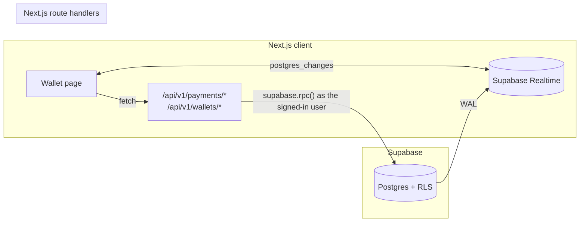
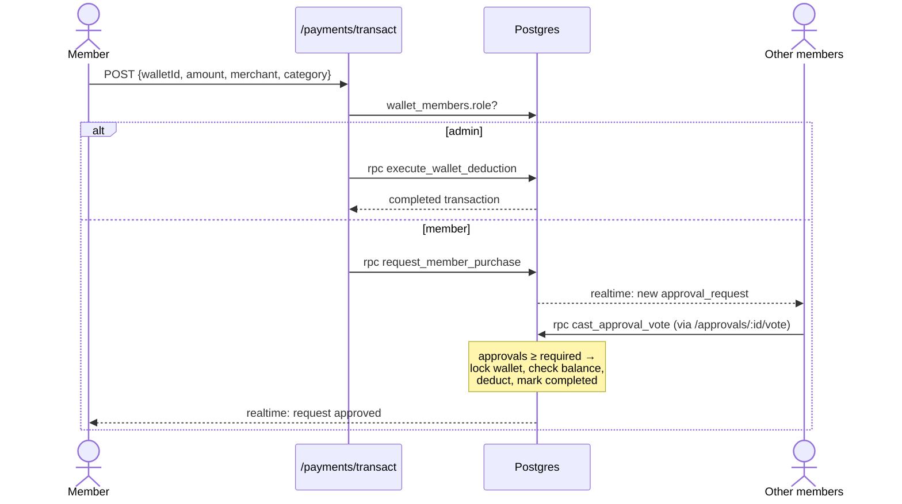
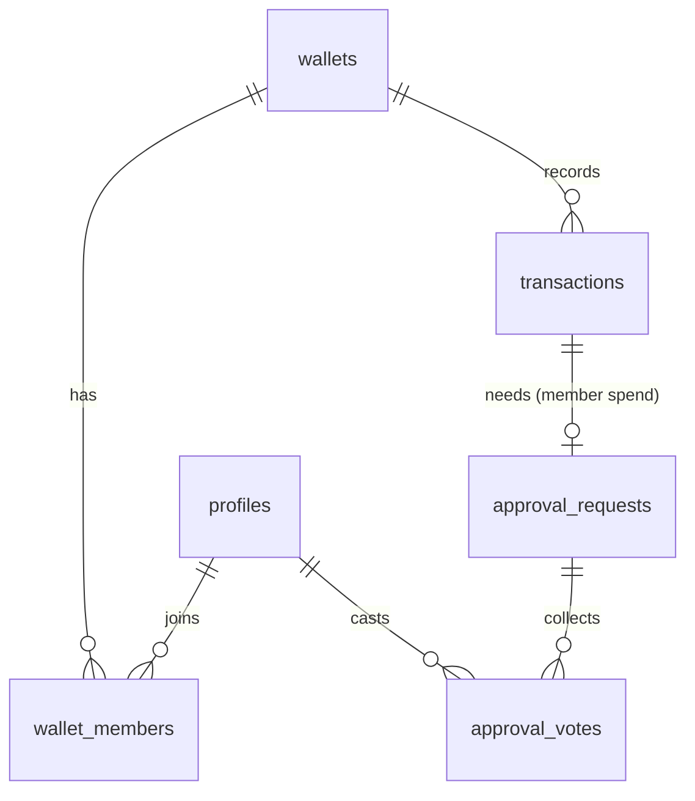

<p align="center"></p>

# ShareWallet

Collaborative expense & shared-account platform. A wallet has one admin who can
spend directly and members whose purchases execute only after the group approves.

**Stack:** Next.js 15 (App Router) · TypeScript · Tailwind CSS v4 · shadcn/ui ·
Supabase (Postgres, Auth, Realtime) · Recharts · Vercel

## Getting started

```bash
cp .env.example .env.local     # fill in your Supabase URL + anon key
npm install
npx supabase db push           # or run supabase/migrations/*.sql in the SQL editor
npm run dev
```

See [docs/supabase-rls.md](docs/supabase-rls.md) for auth, realtime and the security model.

## System design



### Purchase flow



### Data model



## API

The OpenAPI 3.0 spec for `/api/v1/*` is in [docs/openapi.yaml](docs/openapi.yaml).

| Method | Path | Purpose |
| --- | --- | --- |
| POST | `/api/v1/payments/transact` | Spend (admin: immediate · member: approval request) |
| POST | `/api/v1/payments/approvals/{requestId}/vote` | Approve / reject a member purchase |
| POST | `/api/v1/wallets` | Create a wallet |
| POST | `/api/v1/wallets/{walletId}/deposit` | Admin top-up |
| POST | `/api/v1/wallets/{walletId}/members` | Admin invites a user by email |

## Analytics

The wallet page shows **monthly burn rate**, a **spend-per-member leaderboard**
and a **category breakdown**, backed by `security_invoker` views so each member
only sees aggregates for their own wallets.

## Design system

| Token | Hex | Use |
| --- | --- | --- |
| Primary | `#FF6B00` Electric Orange | actions, focus ring, charts |
| Secondary | `#FF9E00` Warm Amber | secondary actions, leaderboard bars |
| Background | `#FFFFFF` | page |
| Neutral dark | `#18181B` Zinc 900 | text |
| Muted | `#F4F4F5` Zinc 100 | surfaces |

Logo: two overlapping rounded wallet shapes (solid admin, translucent consensus)
with a negative-space checkmark ([public/logo.svg](public/logo.svg)).

## Deploy

Import the repo in Vercel and set `NEXT_PUBLIC_SUPABASE_URL` and
`NEXT_PUBLIC_SUPABASE_ANON_KEY`. Add the production `/auth/callback` URL to
Supabase's redirect allow-list.
